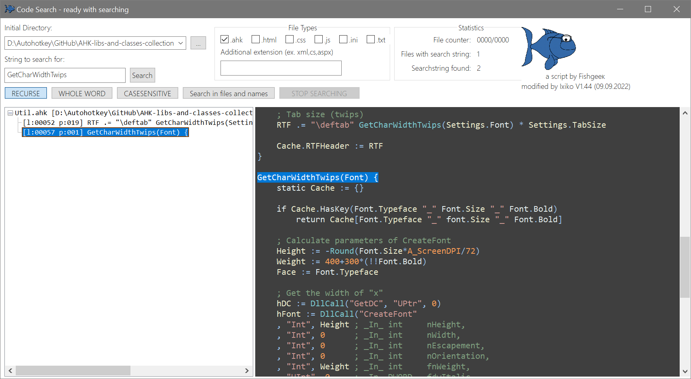

<h5>Original code from fishgeek / modified last on 09.09.2022 (V1.43) from Ixiko</h5>

<h4>Original text from fischgeek's repository</h4>

 Remember that bit of code you wrote, but can't remember exactly where you wrote it? 
Try using this tool to target a directory and search for a keyword inside of your code files.
 

<h4>AHK-CodeSearch I have made for <a href="https://github.com/Ixiko/AHK-libs-and-classes-collection">[AHK-libs-and-classes-collection]</a></h4>

#### ***<u>You still find bugs? Do you think there is still room for improvement? Then you are more than right!</u>***

## VERSION HISTORY

### V1.44		

- Search in files and/or file names
- Added an RichCode (/Edit)-Control to show your found code highlighted
- class_RichCode.ahk got additional functions
- Removed the ListView for a TreeView control
- Click on a sub-item in TreeView and it scrolls into view!
- Add a context menu to the TreeView control with the options to Edit, Execute and Open Script Folder
- The width of TreeView and RichEdit-Control can be adjusted with a mouse drag in the gap between both controls
- Window position, size and the sizes of TreeView and RichCode control will be stored after closing the Gui

### V1.3

- Gui Resize for ListView control is working
- Showing the last number of files in directory
- Change the code to the coding conventions of AHK_L V 1.1.30.0
- Ready to enter the search string right after the start
- Pressing Enter after entering the search string starts the search immediately
- The buttons R, W, C now show their long names

### V1.2
- Stop/Resume Button is added - so the process can be interrupted even to start a new search
- a. from fischgeek Todo -  Find an icon - i take yours and it looks great!

### V1.1
- the window displays the number of files read so far and the number of digits found during the search process
- Font size and window size is adapted to 4k monitors (Size of Gui is huge - over 3000 pixel width) - at the moment, no resize or any settings for the size of the contents is possible - i'm sorry for that
